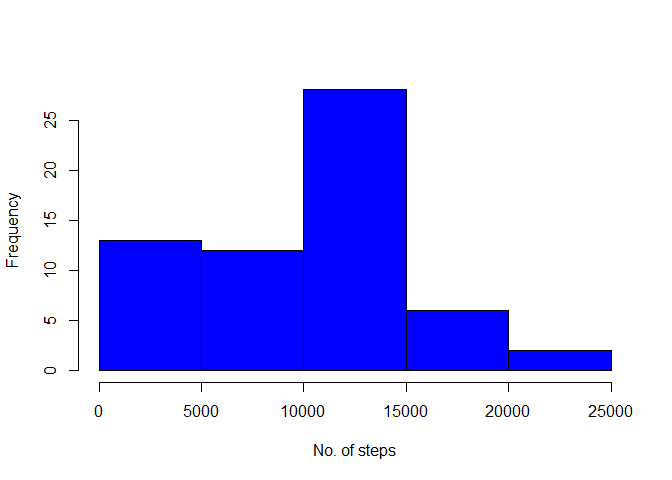

# Reproducible Research - Project 1
Eduardo  
11th May 2016  


## Loading and preprocessing the data


```r
# Read activity file into input_file variable
input_file <- read.csv("activity.csv")
```


## What is mean total number of steps taken per day?

```r
output <- tapply(input_file$steps, input_file$date, sum, na.rm=TRUE)
output <- data.frame(date=names(output), steps=output)
output$steps <- as.numeric(output$steps)
hist(output$steps, col="blue", xlab = "No. of steps", main="")
```

<!-- -->

```r
mean1 <- mean(output$steps, na.rm=TRUE)
mean1
```

```
## [1] 9354.23
```

```r
median1 <- median(output$steps, na.rm=TRUE)
median1
```

```
## [1] 10395
```


## What is the average daily activity pattern?


```r
library('ggplot2')
```

```
## Warning: package 'ggplot2' was built under R version 3.2.4
```

```r
input_file <- read.csv("activity.csv")
output <- tapply(input_file$steps, input_file$interval, mean, na.rm=TRUE)
output <- data.frame(interval=names(output), steps=output)
output$steps <- as.numeric(output$steps)
output$interval <- as.numeric(as.character(output$interval))
ggplot(data = output, aes(x = interval, y = steps)) + geom_line() + xlab("5-minute interval") + ylab("average number of steps taken")
```

<!-- -->


Which 5-minute interval, on average across all the days in the dataset, contains the maximum number of steps?


```r
output[which.max(output$steps),]
```

```
##     interval    steps
## 835      835 206.1698
```

## Imputing missing values

Calculate and report the total number of missing values in the dataset (i.e. the total number of rows with NAs)


```r
input_file <- read.csv("activity.csv")
sum(is.na(input_file$steps))
```

```
## [1] 2304
```


All of the missing values are filled in with mean value for that 5-minute interval.


```r
input_file <- read.csv("activity.csv")
output <- tapply(input_file$steps, input_file$interval, mean, na.rm=TRUE)
output <- data.frame(interval=names(output), steps=output)
output$steps <- as.numeric(output$steps)
output$interval <- as.numeric(as.character(output$interval))
```

Creating a new dataset that is equal to the original dataset but with the missing data filled in.


```r
for (i in 1:nrow(input_file))
{
        if(is.na(input_file[i,'steps']))
        {
                
                input_file[i,'steps'] = output[output$interval == input_file[i,'interval'],'steps']
        }
}
```

Making a histogram of the total number of steps taken each day.


```r
output <- tapply(input_file$steps, input_file$date, sum, na.rm=TRUE)
output <- data.frame(date=names(output), steps=output)
output$steps <- as.numeric(output$steps)
hist(output$steps, xlab = "No. of steps taken each day.", main="")
```

<!-- -->

Calculating and report the mean and median total number of steps taken per day.


```r
mean1 <- mean(output$steps, na.rm=TRUE)
mean1
```

```
## [1] 10766.19
```

```r
median1 <- median(output$steps, na.rm=TRUE)
median1
```

```
## [1] 10766.19
```
We find that the Mean and Median values are higher after imputing the missing data. In the original data set the missing values for steps are converted to 0's by default in our calculations which result in lower vlaues for the Median and Mean. After removing the missing values the resulting values of Mean and Median obviously increase from before. 

## Are there differences in activity patterns between weekdays and weekends?


```r
input_file <- read.csv("activity.csv")
output <- tapply(input_file$steps, input_file$interval, mean, na.rm=TRUE)
output <- data.frame(interval=names(output), steps=output)
output$steps <- as.numeric(output$steps)
output$interval <- as.numeric(as.character(output$interval))

for (i in 1:nrow(input_file))
{
        if(is.na(input_file[i,'steps']))
        {
                
                input_file[i,'steps'] = output[output$interval == input_file[i,'interval'],'steps']
        }
}

input_file$date <- as.Date(as.character(input_file$date))
# Weekdays are in spanish
weekdays1 <- c('lunes', 'martes', 'miércoles', 'jueves', 'viernes')

input_file$Day <- factor((weekdays(input_file$date) %in% weekdays1), levels=c(FALSE, TRUE), labels=c('weekend', 'weekday'))

output <- aggregate(steps ~ Day + interval, input_file, FUN=mean)

ggplot(output, aes(interval, steps)) + geom_line() + facet_grid(Day ~ .) + 
    xlab("5-minute interval") + ylab("Number of steps")
```

<!-- -->
